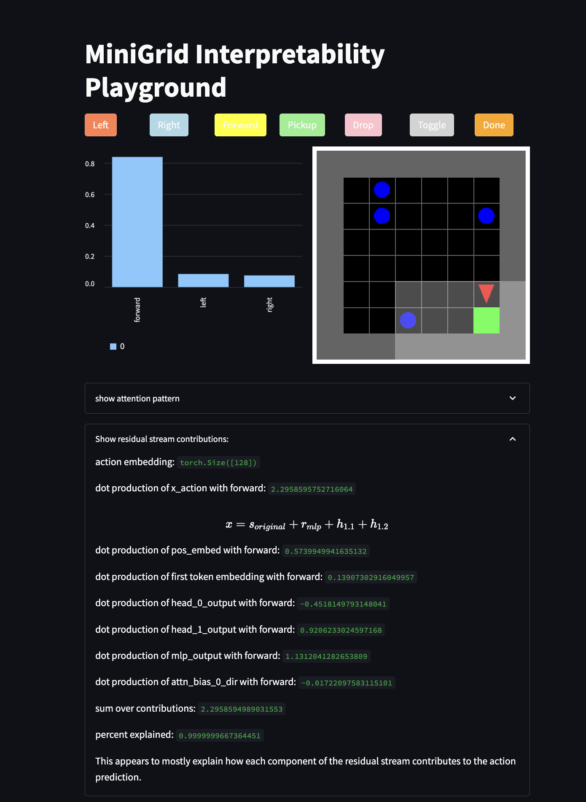

# Decision Transformer Interpretability

<p align="center">
    
</p>

[](https://github.com/jbloomAus/DecisionTransformerInterpretability/actions/workflows/build.yml)

In this project, we intend to apply a mathematical framework for transformer circuits to study transformer models trained on reinforcement tasks to create a simpler context than large language models for understanding high-level concepts, such as goal-directedness, in transformer architecture.

 To begin, we hope to train a small transformer model (maximum of two layers, implemented via the Transformer Lens interpretability library) to solve MiniGrid RL tasks. Once we achieve good performance, we will attempt to find mechanistic explanations for the agent's behaviour, such as how it decides whether to move toward the door or the key.

Interpretability of such circuits may be a valuable step towards understanding high-level concepts such as deception or goal-directedness in transformer circuits.

Future work may include attempting to manually edit decision transformers to modify goals and behavior.

## Write Up

You can find an initial technical report for this project [here](https://www.lesswrong.com/posts/bBuBDJBYHt39Q5zZy/decision-transformer-interpretability).

## Package Overview

Currently the package has 3 important components:
- The ppo subpackage. This package enables users to train a PPO agent on a gym environment and store the trajectories generated *during training*.
- The decision_transformer subpackage. This package contains the decision transformer implementation.
- the streamlit app. This app (currently in development) enables researchers to play minigrid games whilst observing the decision transformer's predictions/activations.

## Current Results

We've successfully trained a decision transformer on several games including [DoorKey](https://minigrid.farama.org/environments/minigrid/DoorKeyEnv/) and [Dynamic Obstacles](https://minigrid.farama.org/environments/minigrid/DynamicObstaclesEnv/).

Calibration Plot            |  MiniGrid-Dynamic-Obstacles-8x8-v0, after 6000 batch, episode length 14, RTG 1.0, reward 0.955
:-------------------------:|:-------------------------:
  |  

The streamlit app is coming along and can show attention patterns, and decompose the residual stream of a decision transformer while a human plays the game.



## Running the scripts

Example bash scripts are provided in the scripts folder. They make use of argparse interfaces in the package.

### Training a PPO agent

If you set 'track' to true, a weights and biases dashboard will be generated. A trajectories pickle file will be generated in the trajectories folder. This file can be used to train a decision tranformer.

```bash
python src/run_ppo.py --exp_name "MiniGrid-Dynamic-Obstacles-8x8-v0" \
    --seed 1 \
    --cuda \
    --track \
    --wandb_project_name "PPO-MiniGrid" \
    --capture_video \
    --env_id "MiniGrid-Dynamic-Obstacles-8x8-v0" \
    --total_timesteps 200000 \
    --learning_rate 0.00025 \
    --num_envs 30 \
    --num_steps 64 \
    --gamma 0.99 \
    --gae_lambda 0.95 \
    --num_minibatches 30 \
    --update_epochs 4 \
    --clip_coef 0.4 \
    --ent_coef 0.25 \
    --vf_coef 0.5 \
    --max_grad_norm 2 \
    --max_steps 300
```

### Training a decision transformer

Targeting the trajectories file and setting the model architecture details and hyperparameters, you can run the decision transformer training script.

```
python src/run_decision_transformer.py \
    --exp_name "MiniGrid-Dynamic-Obstacles-8x8-v0" \
    --trajectory_path "trajectories/MiniGrid-Dynamic-Obstacles-8x8-v0bd60729d-dc0b-4294-9110-8d5f672aa82c.pkl" \
    --d_model 128 \
    --n_heads 2 \
    --d_mlp 256 \
    --n_layers 1 \
    --learning_rate 0.0001 \
    --batch_size 128 \
    --batches 6001 \
    --n_ctx 3 \
    --pct_traj 1 \
    --weight_decay 0.001 \
    --seed 1 \
    --wandb_project_name "DecisionTransformerInterpretability" \
    --test_frequency 100 \
    --test_batches 10 \
    --eval_frequency 100 \
    --eval_episodes 10 \
    --initial_rtg 1 \
    --prob_go_from_end 0.1 \
    --eval_max_time_steps 1000 \
    --cuda True \
    --track False
```

### Running the streamlit app

To run the streamlit app:

```bash
streamlit run app.py
```

## Setting up the environment

I haven't been too careful about this yet. Using python 3.9.15 with the requirements.txt file. We're using the V2 branch of transformer lens and Minigrid 2.1.0.

The docker file should work and we can make use of it more when the project is further ahead/if we are alternativing developers frequently and have any differential behavior.

```bash
./scripts/build_docker.sh
./scripts/run_docker.sh
```

Then you can ssh into the docker and a good ide will bring credentials etc.

## Development

### Tests:

Ensure that the run_tests.sh script is executable:
```bash
chmod a+x ./scripts/run_tests.sh
```

Run the tests:
```bash
./scripts/run_tests.sh
```

You should see something like this after the tests run. This is the coverage report. Ideally this is 100% but we're not there yet. Furthermore, it will be 100% long before we have enough tests. But if it's 100% and we have performant code with agents training and stuff otherwise working, that's pretty good.

```bash

---------- coverage: platform darwin, python 3.9.15-final-0 ----------
Name                                Stmts   Miss  Cover   Missing
-----------------------------------------------------------------
src/__init__.py                         0      0   100%
src/decision_transformer.py           132      8    94%   39, 145, 151, 156-157, 221, 246, 249
src/ppo.py                             20     20     0%   2-28
src/ppo/__init__.py                     0      0   100%
src/ppo/agent.py                      109     10    91%   41, 45, 112, 151-157
src/ppo/compute_adv_vectorized.py      30     30     0%   1-65
src/ppo/memory.py                      88     11    88%   61-64, 119-123, 147-148
src/ppo/my_probe_envs.py               99      9    91%   38, 42-44, 74, 99, 108, 137, 168
src/ppo/train.py                       69      6    91%   58, 74, 94, 98, 109, 113
src/ppo/utils.py                      146     54    63%   41-42, 61-63, 69, 75, 92-96, 110-115, 177-206, 217-235
src/utils.py                           40     17    58%   33-38, 42-65, 73, 76-79
src/visualization.py                   25     25     0%   1-34
-----------------------------------------------------------------
TOTAL                                 758    190    75%
```

# Next Steps

- I'm currently completing the first sprint which will end with a technical write up of the Dynamic Obstacles trained decision tranformer circuit.
    - This is mostly done except that I am trying to complete my understanding of the circuits and internal representations used by the agent.
- After this there are several possible next steps including:
    - Trying to make non-trivial edits to the dynamic obstacles model.
    - Trying to see if a larger agent may be better calibrated and/or implement more interesting circuits.
    - Moving on to other environments (such as the KeyDoor environment)

In the long run, we would like to study more complicated environments which involve instrumental goals or the need for search or searchlike behavior.

# References:

- [decision transformers](https://arxiv.org/pdf/2106.01345.pdf)
- [gym-minigrid](https://github.com/Farama-Foundation/Minigrid)
- [transformerlens](https://github.com/neelnanda-io/TransformerLens)
