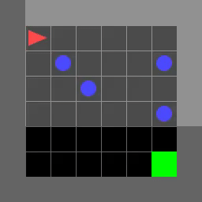

# Decision Transformer Interpretability

[](https://github.com/jbloomAus/DecisionTransformerInterpretability/actions/workflows/build.yml)

# [Docs Here](https://jbloomaus.github.io/DecisionTransformerInterpretability/) [App Here](https://jbloomaus-decisiontransformerinterpretability-app-4edcnc.streamlit.app/)

This project is designed to facilitate mechanistic interpretability of decision transformers as well as RL agents using transformer architectures.

This is achieved via:
- Training scripts for online RL agents using the PPO algorithm. This training script can be used to generate trajectories for training a decision transformer.
- A decision transformer implementation and training script. This implementation is based on the [transformer architecture](https://arxiv.org/abs/1706.03762) and the [decision transformer architecture](https://arxiv.org/abs/2106.01345).
- A streamlit app. This app enables researchers to play minigrid games whilst observing the decision transformer's predictions/activations.

Future work will include:
- creating an interpretability portfolio, expanding various exploratory techniques already present in the streamlit app.
- solving tasks which require memory or language instruction. Many MiniGrid tasks require agents have memory and currently our PPO agent only responds to the last timestep.
- validating hypotheses about model circuits using [casual scrubbing](https://www.alignmentforum.org/posts/JvZhhzycHu2Yd57RN/causal-scrubbing-a-method-for-rigorously-testing).

## Write Up

You can find an initial technical report for this project [here](https://www.lesswrong.com/posts/bBuBDJBYHt39Q5zZy/decision-transformer-interpretability).

## Package Overview

The package contains several important components:
- The environments package which provides utilities for generating environments (mainly focussed on MiniGrid).
- The decision_transformer package which provides utilities for training and evaluating decision transformers (via calibration curves).
- The ppo package which provides utilities for training and evaluating PPO agents.
- The streamlit app which provides a user interface for playing games and observing the decision transformer's predictions/activations.
- The models package which provides the a common trajectory-transformer class so as to keep architectures homogeneous across the project.

Other notable files/folders:
- The scripts folder contains bash scripts which show how to use various interfaces in the project.
- The test folder which contains extensive tests for the projcect.

## Example Results

We've successfully trained a decision transformer on several games including [DoorKey](https://minigrid.farama.org/environments/minigrid/DoorKeyEnv/) and [Dynamic Obstacles](https://minigrid.farama.org/environments/minigrid/DynamicObstaclesEnv/).

Calibration Plot            |  MiniGrid-Dynamic-Obstacles-8x8-v0, after 6000 batch, episode length 14, RTG 1.0, reward 0.955
:-------------------------:|:-------------------------:
  |  

I highly recommend playing with the streamlit app if you are interested in this project. It relies heavily on an understanding of the [Mathematical Framework for Transformer Circuits](https://transformer-circuits.pub/2021/framework/index.html).


## Running the scripts

Example bash scripts are provided in the scripts folder. They make use of argparse interfaces in the package.

### Training a PPO agent

If you set 'track' to true, a weights and biases dashboard will be generated. A trajectories pickle file will be generated in the trajectories folder. This file can be used to train a decision tranformer.

```bash
python -m src.run_ppo --exp_name "Test" \
    --seed 1 \
    --cuda \
    --track \
    --wandb_project_name "PPO-MiniGrid" \
    --env_id "MiniGrid-DoorKey-8x8-v0" \
    --view_size 5 \
    --total_timesteps 350000 \
    --learning_rate 0.00025 \
    --num_envs 8 \
    --num_steps 128 \
    --num_minibatches 4 \
    --update_epochs 4 \
    --clip_coef 0.2 \
    --ent_coef 0.01 \
    --vf_coef 0.5 \
    --max_steps 1000 \
    --one_hot_obs

```

### Training a decision transformer

Targeting the trajectories file and setting the model architecture details and hyperparameters, you can run the decision transformer training script.

```bash
python -m src.run_decision_transformer \
    --exp_name MiniGrid-Dynamic-Obstacles-8x8-v0-Refactor \
    --trajectory_path trajectories/MiniGrid-Dynamic-Obstacles-8x8-v0bd60729d-dc0b-4294-9110-8d5f672aa82c.pkl \
    --d_model 128 \
    --n_heads 2 \
    --d_mlp 256 \
    --n_layers 1 \
    --learning_rate 0.0001 \
    --batch_size 128 \
    --train_epochs 5000 \
    --test_epochs 10 \
    --n_ctx 3 \
    --pct_traj 1 \
    --weight_decay 0.001 \
    --seed 1 \
    --wandb_project_name DecisionTransformerInterpretability-Dev \
    --test_frequency 1000 \
    --eval_frequency 1000 \
    --eval_episodes 10 \
    --initial_rtg -1 \
    --initial_rtg 0 \
    --initial_rtg 1 \
    --prob_go_from_end 0.1 \
    --eval_max_time_steps 1000 \
    --track True

```

Note, if you want the training data from the blog post, you can download it like so

```bash
cd trajectories
gdown 1UBMuhRrM3aYDdHeJBFdTn1RzXDrCL_sr
```

### Running the streamlit app

To run the streamlit app:

```bash
streamlit run app.py
```

## Setting up the environment

I haven't been too careful about this yet. Using python 3.9.15 with the requirements.txt file. We're using the V2 branch of transformer lens and Minigrid 2.1.0.

```
conda env create --name decison_transformer_interpretability python=3.9.15
conda activate decison_transformer_interpretability
pip install -r requirements.txt
```

The docker file should work and we can make use of it more when the project is further ahead/if we are alternativing developers frequently and have any differential behavior.

```bash
./scripts/build_docker.sh
./scripts/run_docker.sh
```

Then you can ssh into the docker and a good ide will bring credentials etc.

## Development

### Tests:

Ensure that the run_tests.sh script is executable:
```bash
chmod a+x ./scripts/run_tests.sh
```

Run the tests. Note: the end to end tests are excluded from the run_test.sh script since they take a while to run. They make wandb dashboards are are useful for debugging but they are not necessary for development.

```bash
./scripts/run_tests.sh
```

You should see something like this after the tests run. This is the coverage report. Ideally this is 100% but we're not there yet. Furthermore, it will be 100% long before we have enough tests. But if it's 100% and we have performant code with agents training and stuff otherwise working, that's pretty good.

```bash

---------- coverage: platform darwin, python 3.9.15-final-0 ----------
Name                                Stmts   Miss  Cover   Missing
-----------------------------------------------------------------
src/__init__.py                         0      0   100%
src/decision_transformer.py           132      8    94%   39, 145, 151, 156-157, 221, 246, 249
src/ppo.py                             20     20     0%   2-28
src/ppo/__init__.py                     0      0   100%
src/ppo/agent.py                      109     10    91%   41, 45, 112, 151-157
src/ppo/compute_adv_vectorized.py      30     30     0%   1-65
src/ppo/memory.py                      88     11    88%   61-64, 119-123, 147-148
src/ppo/my_probe_envs.py               99      9    91%   38, 42-44, 74, 99, 108, 137, 168
src/ppo/train.py                       69      6    91%   58, 74, 94, 98, 109, 113
src/ppo/utils.py                      146     54    63%   41-42, 61-63, 69, 75, 92-96, 110-115, 177-206, 217-235
src/utils.py                           40     17    58%   33-38, 42-65, 73, 76-79
src/visualization.py                   25     25     0%   1-34
-----------------------------------------------------------------
TOTAL                                 758    190    75%
```

# Next Steps

- Getting PPO to work with a transformer architecture.
- Analyse this model/the decision transformer/a behavioural clone and publish the results.
- Get a version of causal-scrubbing working
- Study BabyAI (adapt all models to take an instruction token that is prepended to the context window)

# Relevant Projects:

- [decision transformers](https://arxiv.org/pdf/2106.01345.pdf)
- [gym-minigrid](https://github.com/Farama-Foundation/Minigrid)
- [transformerlens](https://github.com/neelnanda-io/TransformerLens)
